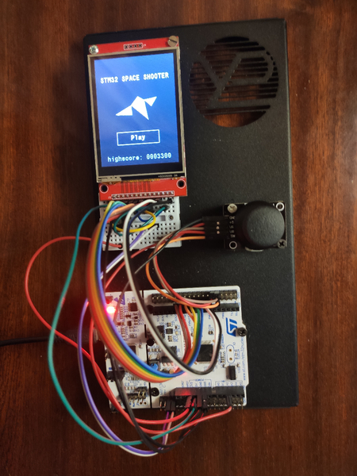
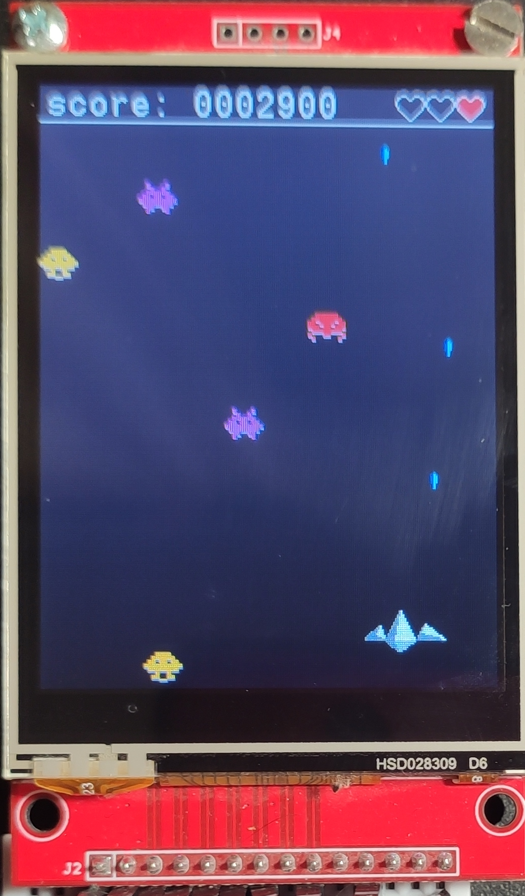
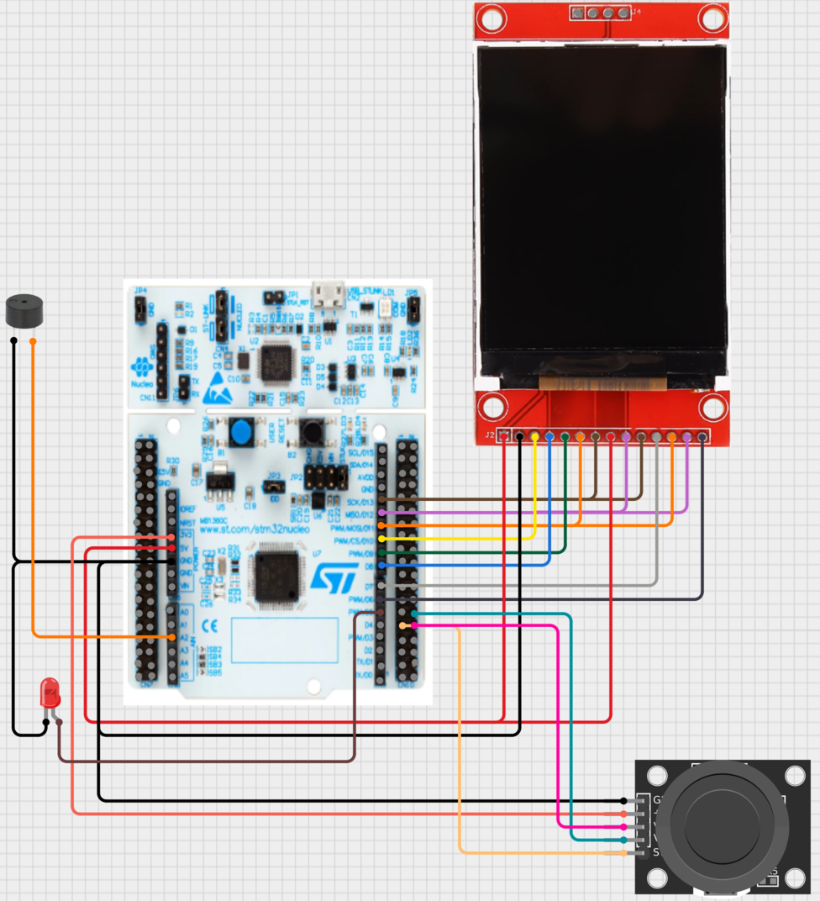
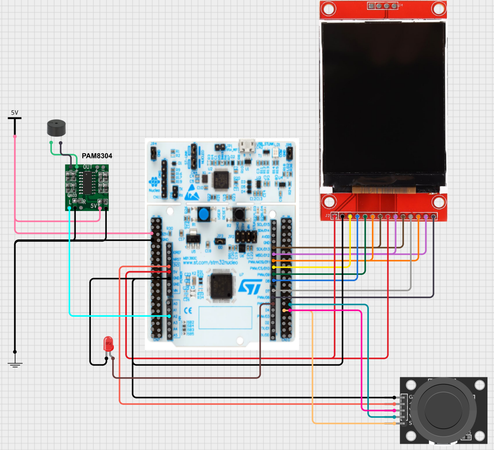

# Гра на мікроконтролері STM32 з дисплеєм ILI9341

[English](./README.md)

## Про проект

Даний пристрій було розроблено в рамках дипломної роботи на тему "Інтерактивна гра для мікроконтролерів STM32 з використанням графічного дисплея".

Гра являє собою класичний космічний шутер із набором очок.

Особливості:
- Плавний ігровий процес із частотою 25 к/c
- Управління через джойстик або тачскрин
- Звукові ефекти
- Складність гри збільшується з часом
- Три типи ворогів
- Рекорди (зберігаються тимчасово в RAM)

## Схема пристрою

Оригінальна схема:

Тут динамік під'єднано напряму до виходу ЦАП мікроконтролера. Це не найкраща ідея, викорустовуйте схему із підсилювачем та зовнішнім джерелом живлення:

